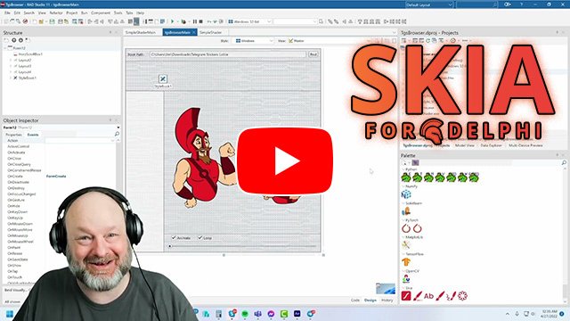
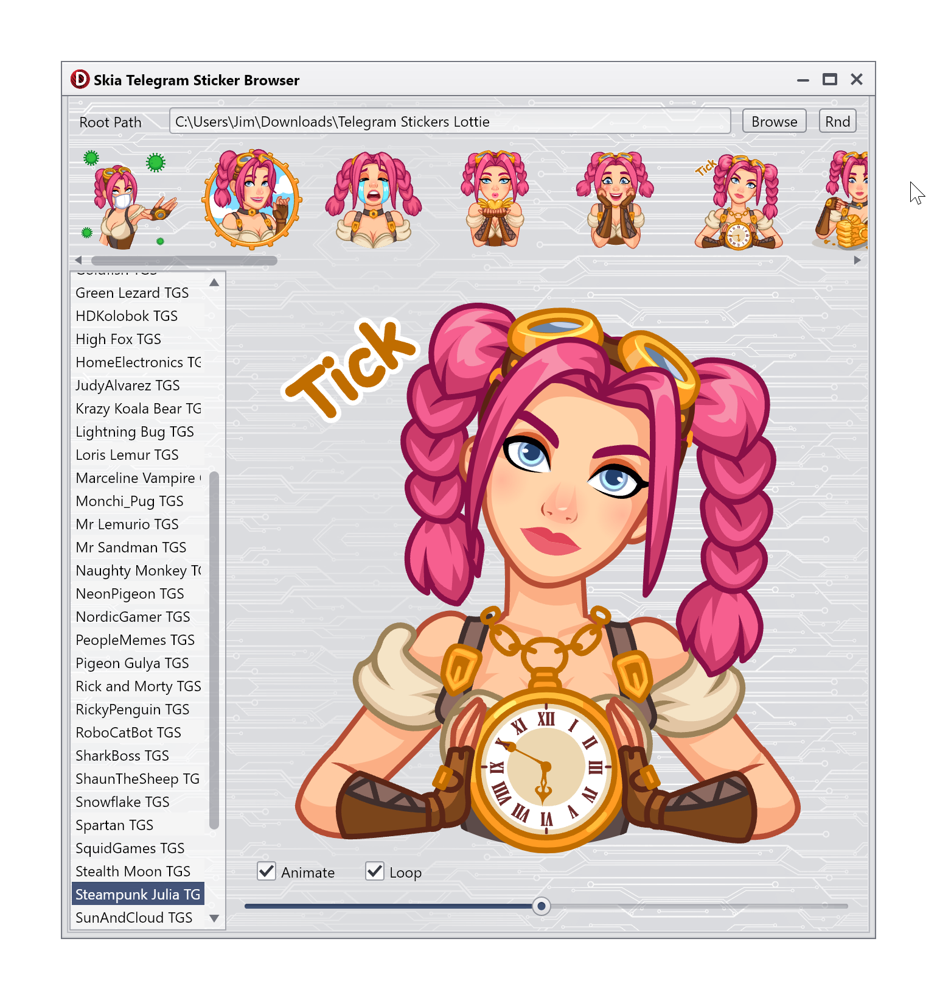

# TelegramStickerBrowser
A browser for Telegram Stickers (tgs) and Lottie (JSON) files written in Delphi with Skia4Delphi.

TelegramStickerBrowser uses the [Skia4Delphi library](https://github.com/skia4delphi/skia4delphi). Be sure you've installed the latest version from the **GetIt** package manager. Note that Skia4Delphi is a fast-moving project under very active development. If you have a problem it might be worth checking that you can reproduce it with the very latest release of Skia4Delphi which you can download directly from the Ski4Delphi [git hub releases page](https://github.com/skia4delphi/skia4delphi/releases).

The TelegramStickerBrowser project includes a small selection of stickers downloaded from [LottieFiles](https://lottiefiles.com/animated-stickers). You can download additional stickers from Telegram via the [@Stickerdownloadbot](https://t.me/Stickerdownloadbot).

[Overview video](https://youtu.be/5CDFWCiOVNM)    
  

    
[Screenshots](screenshots/readme.md)

This was originally developed with the [Techno Light Style](https://delphistyles.com/fmx/TechnoLineLight.html) by DelphiStyles, but it is uploaded here with the Transparent style.

This is a FireMonkey (FMX) application, so should also work on Android, iOS, macOS, and Linux, but only tested on Windows. Developed with [Delphi 11.1 Alexadria](https://www.embarcadero.com/products/delphi), but should be compilable with the free [Delphi Community Edition](https://www.embarcadero.com/products/delphi/starter) as well.
